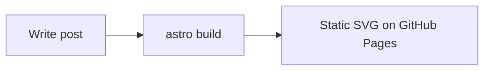

# Hung Blog — reference

## Paths

| Item | Path |
|------|------|
| English posts | `src/content/blog/en/{slug}.md` |
| Vietnamese posts | `src/content/blog/vi/{slug}.md` |
| Schema | `src/content.config.ts` |
| Category labels | `src/lib/i18n.ts` |
| Series roadmaps | `docs/series/` |

URL pattern: `https://hupham.github.io/{lang}/blog/{slug}/`

## Categories

From `src/content.config.ts` (one per post):

| Value | Typical use |
|-------|-------------|
| `claude` | Claude / AI tooling |
| `web-development` | Astro, frontend, GitHub Pages |
| `programming` | Languages, patterns |
| `devops` | K8s, CI/CD, infra |
| `database` | SQL, storage |
| `system-design` | Architecture |
| `notes` | Short notes, misc |

Tags: lowercase kebab-case array, e.g. `["kubernetes", "kubectl", "devops"]`.

## English post template

```md
---
title: "My New Post"
description: "A short summary of what this post is about."
pubDate: 2026-05-22
category: "web-development"
tags: ["astro", "github-pages"]
lang: "en"
slug: "my-new-post"
translationKey: "my-new-post"
---

Opening paragraph (1–2 sentences).

## Section Title

Content with fenced code:

```ts title="src/lib/example.ts"
export function hello() {
  return "world";
}
```

External links like [Astro](https://astro.build/) need no `target="_blank"`.
```

## Vietnamese post template

```md
---
title: "Bài Viết Mới"
description: "Tóm tắt ngắn về nội dung bài viết."
pubDate: 2026-05-22
category: "web-development"
tags: ["astro", "github-pages"]
lang: "vi"
slug: "bai-viet-moi"
translationKey: "my-new-post"
---

Đoạn mở đầu (1–2 câu).

## Tiêu đề phần

Nội dung bài viết.
```

Bilingual pair: same `translationKey`, different `slug` per language.

## Series frontmatter (example: kubernetes-co-ban)

```yaml
category: "devops"
lang: "vi"
slug: "gioi-thieu-kubernetes"
translationKey: "gioi-thieu-kubernetes"
series:
  id: "kubernetes-co-ban"
  title: "Kubernetes từ đầu"
  order: 1
tags: ["kubernetes", "kubectl", "devops", "containers"]
```

English series post — translate `series.title`, keep `series.id` and `series.order`:

```yaml
series:
  id: "kubernetes-co-ban"
  title: "Kubernetes from scratch"
  order: 1
```

## Optional fields

```yaml
updatedDate: 2026-05-23
draft: true
```

## Mermaid

````md

````

## Commands

```bash
# Validate schema + build
npm run build

# Local dev
npm run dev

# Clear Astro cache + dev (diagrams / stale content)
npm run dev:fresh

# Playwright for Mermaid (first time)
npm run setup:diagrams
```

Requires Node.js `>=22.12.0`.

## Troubleshooting

| Issue | Fix |
|-------|-----|
| Schema / category error | Use enum from `content.config.ts` |
| Mermaid not in dev | `npm run setup:diagrams`, `rm -rf .astro`, `npm run dev:fresh` |
| Deleted post still shows | `rm -rf .astro dist`, rebuild |
| No language switcher | Matching `translationKey`, different `lang` on pair |

## Sample files in repo

- Post: `src/content/blog/vi/gioi-thieu-kubernetes.md`
- Roadmap: `docs/series/kubernetes-co-ban.md`
- Docs index: `docs/series/README.md`
- Site README: `README.md` (Writing Blog Posts)
