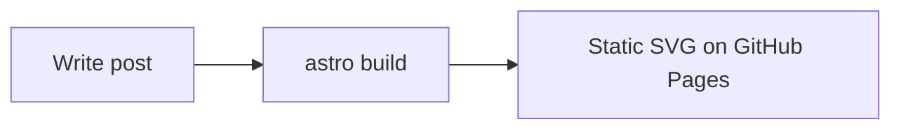

# Hung Blog

Personal technology blog built with [Astro](https://astro.build/) and deployed to GitHub Pages.

The site is fully static, supports English and Vietnamese routes, and uses Markdown content collections for blog posts.

## Requirements

- Node.js `>=22.12.0`
- npm

Check your local version:

```bash
node --version
npm --version
```

If your Node version is lower than `22.12.0`, upgrade Node before running Astro commands locally.

## Install

```bash
npm install
```

## Run Local Development

```bash
npm run dev
```

Astro will start a local dev server, usually at:

```text
http://localhost:4321
```

Main local URLs:

- English home: `http://localhost:4321/en/`
- Vietnamese home: `http://localhost:4321/vi/`
- Root path: `http://localhost:4321/` redirects to English by default.

## Build

```bash
npm run build
```

This command runs:

```bash
astro check && astro build
```

It validates Astro/TypeScript types and generates the static site into:

```text
dist/
```

## Preview Production Build

After building:

```bash
npm run preview
```

This serves the generated `dist/` output locally so you can test the production build.

## Project Structure

```text
.
├── .github/workflows/deploy.yml
├── astro.config.mjs
├── package.json
├── public/
├── src/
│   ├── components/
│   ├── content.config.ts
│   ├── content/
│   │   └── blog/
│   │       ├── en/
│   │       └── vi/
│   ├── layouts/
│   ├── lib/
│   ├── pages/
│   │   ├── index.astro
│   │   └── [lang]/
│   └── styles/
└── README.md
```

Important files:

- `src/content.config.ts`: blog post schema, category list, language list.
- `src/lib/i18n.ts`: language labels, category labels, URL helpers, translation matching.
- `src/content/blog/en/`: English posts.
- `src/content/blog/vi/`: Vietnamese posts.
- `src/pages/[lang]/`: generated routes for each language.
- `.github/workflows/deploy.yml`: GitHub Pages deployment workflow.
- `docs/series/`: roadmap và trạng thái bài theo chuỗi (không publish lên site).

## Series content plans

Kế hoạch nội dung từng chuỗi bài (order, slug, trạng thái publish) nằm trong [`docs/series/`](docs/series/README.md).

Ví dụ: [Kubernetes từ đầu](docs/series/kubernetes-co-ban.md) — series id `kubernetes-co-ban`, 12 phần từ cơ bản đến production.

Cập nhật file roadmap khi publish bài mới trong series.

## Writing Blog Posts

Blog posts live in the Astro content collection at:

```text
src/content/blog/en/
src/content/blog/vi/
```

Use `src/content/blog/en/` for English posts and `src/content/blog/vi/` for Vietnamese posts. Each post is a Markdown or MDX file with frontmatter at the top.

### Add A New Post

1. Choose the language folder:
   - English: `src/content/blog/en/`
   - Vietnamese: `src/content/blog/vi/`
2. Create a new file using a kebab-case filename, for example:

```text
src/content/blog/en/my-new-post.md
src/content/blog/vi/bai-viet-moi.md
```

3. Add frontmatter at the top of the file.
4. Write the post content below the frontmatter.
5. Run `npm run build` to validate the content schema and generated routes.

### Frontmatter Fields

Every post must include these fields:

| Field | Required | Example | Notes |
| --- | --- | --- | --- |
| `title` | Yes | `"My New Post"` | Displayed as the post title. |
| `description` | Yes | `"A short summary."` | Used on cards and page metadata. |
| `pubDate` | Yes | `2026-05-20` | Publish date. Use `YYYY-MM-DD`. |
| `category` | Yes | `"web-development"` | Must be one of the configured categories. |
| `tags` | Yes | `["astro", "github-pages"]` | Use lowercase kebab-case tags. Empty array is allowed. |
| `lang` | Yes | `"en"` or `"vi"` | Must match the language folder. |
| `slug` | Yes | `"my-new-post"` | Controls the final URL. |
| `translationKey` | Yes | `"my-new-post"` | Links translated versions together. |
| `updatedDate` | No | `2026-05-21` | Optional last-updated date. |
| `series` | No | See below | Optional series metadata. |
| `draft` | No | `true` | Optional. Draft posts are not published. |

The post URL is based on `lang` and `slug`:

```text
/en/blog/my-new-post/
/vi/blog/bai-viet-moi/
```

### English Post Template

```md
---
title: "My New Post"
description: "A short summary of what this post is about."
pubDate: 2026-05-20
category: "web-development"
tags: ["astro", "github-pages"]
lang: "en"
slug: "my-new-post"
translationKey: "my-new-post"
---

Write the post content here.

## Section Title

Use normal Markdown for headings, paragraphs, lists, links, and code blocks.

Links to third-party sites (for example `https://kubernetes.io`) open in a new browser tab automatically. Relative links and same-site URLs stay in the current tab.

### Vietnamese Post Template

```md
---
title: "Bài Viết Mới"
description: "Tóm tắt ngắn về nội dung bài viết."
pubDate: 2026-05-20
category: "web-development"
tags: ["astro", "github-pages"]
lang: "vi"
slug: "bai-viet-moi"
translationKey: "my-new-post"
---

Viết nội dung bài ở đây.

## Tiêu đề phần

Dùng Markdown bình thường cho heading, paragraph, list, link, và code block.
```

The English and Vietnamese versions are linked by the same `translationKey`. The `slug` can be different per language, but `translationKey` should stay the same.

### Code Blocks

Use fenced code blocks with a language tag for syntax highlighting:

````md
```ts
export function hello() {
  return "world";
}
```
````

Add an optional `title` meta value to show a filename in the code block header:

````md
```ts title="src/lib/example.ts"
export function hello() {
  return "world";
}
```
````

The site renders fenced blocks with syntax highlighting and a copy button. Inline code such as `` `npm run build` `` remains styled as inline text.

### Mermaid Diagrams

Use a fenced code block with the `mermaid` language tag. Diagrams are rendered to static SVG at build time (no client-side JavaScript needed).

````md

````

Build requirements:

- `rehype-mermaid` and `playwright` are installed as dependencies
- Playwright Chromium must be available when running `npm run build` or `npm run dev`
- Local setup: `npm run setup:diagrams` (or `npx playwright install --with-deps chromium`)
- CI already installs Playwright in `.github/workflows/deploy.yml`

Diagrams do not show in `npm run dev`?

Astro caches rendered Markdown in `.astro/`. If you installed Playwright or enabled Mermaid after the cache was created, old entries may still be stored without diagram SVG. Fix:

```bash
npm run setup:diagrams
rm -rf .astro
npm run dev
```

Or use `npm run dev:fresh` to clear the cache and start dev in one step.

Also make sure you are on Node `>=22.12.0` when running Astro locally.

### Deleted posts still appear in dev or build

Astro caches the content collection index in `.astro/` (especially `.astro/data-store.json`). If you delete Markdown files but the site still shows old posts, the cache is probably stale.

Fix:

```bash
rm -rf .astro dist
npm run dev
```

Or:

```bash
npm run dev:fresh
```

Also check:

- You are running `npm run dev`, not opening old files in `dist/` directly.
- If testing production output, run `npm run build` again after deleting posts.
- Hard refresh the browser (or use a private window) to avoid cached HTML.

See sample diagrams in:

- `src/content/blog/en/github-actions-deploy.md`
- `src/content/blog/vi/deploy-bang-github-actions.md`

### Add A Translated Version

To add a translation for an existing post:

1. Create a new Markdown file in the other language folder.
2. Set `lang` to the new language.
3. Use a localized `slug`.
4. Reuse the original post's `translationKey`.
5. Translate `title`, `description`, and body content.

Example pair:

```yaml
# src/content/blog/en/my-new-post.md
lang: "en"
slug: "my-new-post"
translationKey: "my-new-post"
```

```yaml
# src/content/blog/vi/bai-viet-moi.md
lang: "vi"
slug: "bai-viet-moi"
translationKey: "my-new-post"
```

If a post has no translation, it is still published normally. The language switcher will show a translation link only when another post with the same `translationKey` exists.

### Add A Post To A Series

Add the optional `series` block when a post belongs to a multi-part series:

```yaml
series:
  id: "astro-blog"
  title: "Building an Astro Blog"
  order: 1
```

Rules:

- Use the same `series.id` for all posts in the same series.
- Use a localized `series.title` for each language.
- Use `series.order` to control the order inside the series.
- Keep `series.order` unique within the same language and series.

### Save A Draft

Set `draft: true` to keep a post out of the published site:

```yaml
draft: true
```

Draft posts are ignored by the public listing pages and generated routes.

### Validate The Post

Run:

```bash
npm run build
```

This catches common issues such as:

- Missing required frontmatter fields.
- Invalid `category`.
- Invalid `lang`.
- Invalid date format.
- Broken content collection schema.

## Languages

Supported languages:

- `en`: English
- `vi`: Vietnamese

URL format:

```text
/en/blog/my-post/
/vi/blog/bai-viet-cua-toi/
```

English is the default language. The root URL `/` redirects to `/en/`.

If a post only has one language version, it is still published normally. The language switcher will only link to another language when a matching post with the same `translationKey` exists.

## Categories And Tags

Each post has one `category` and many `tags`.

Current categories are defined in `src/content.config.ts`:

```ts
"web-development"
"programming"
"devops"
"database"
"system-design"
"notes"
```

Category display labels are defined in `src/lib/i18n.ts`.

To add, remove, or rename a category:

1. Update the `category` enum in `src/content.config.ts`.
2. Update `categoryLabels` in `src/lib/i18n.ts` for both `en` and `vi`.
3. Update existing post frontmatter if needed.

Category pages are generated automatically:

```text
/en/categories/web-development/
/vi/categories/web-development/
```

Tag pages are also generated automatically:

```text
/en/tags/astro/
/vi/tags/astro/
```

## Deploy To GitHub Pages

Deployment is handled by GitHub Actions in:

```text
.github/workflows/deploy.yml
```

The workflow runs when code is pushed to the `main` branch.

Before deploying, make sure GitHub Pages is configured correctly:

1. Open the GitHub repository.
2. Go to `Settings` -> `Pages`.
3. Under `Build and deployment`, set `Source` to `GitHub Actions`.
4. Push to `main`.
5. Open the `Actions` tab and wait for `Deploy to GitHub Pages` to finish.

For a user site repository named `hungp29.github.io`, the expected production URL is:

```text
https://hungp29.github.io
```

## Generated Folders

Do not commit these folders:

- `node_modules/`
- `dist/`
- `.astro/`

They are already ignored in `.gitignore`.

Purpose:

- `node_modules/`: installed dependencies.
- `dist/`: production build output.
- `.astro/`: generated Astro types and content metadata for local tooling.

## Useful Commands

```bash
npm install
npm run dev
npm run build
npm run preview
```

## Troubleshooting

### Astro says Node.js is not supported

Astro requires Node.js `>=22.12.0`.

Upgrade Node, then reinstall dependencies:

```bash
rm -rf node_modules
npm install
```

### GitHub Pages URL does not work

Check:

- The repository is named `hungp29.github.io` for a user site.
- The workflow exists at `.github/workflows/deploy.yml`.
- GitHub Pages source is set to `GitHub Actions`.
- The latest workflow run in the `Actions` tab succeeded.
- You pushed to the `main` branch.

### A category page is missing

Astro only generates category pages for categories used by at least one published post in that language.

### A language switch link is missing

Make sure both posts use the same `translationKey` and different `lang` values.
