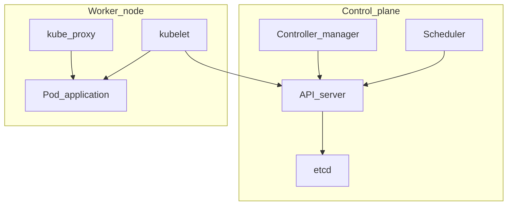
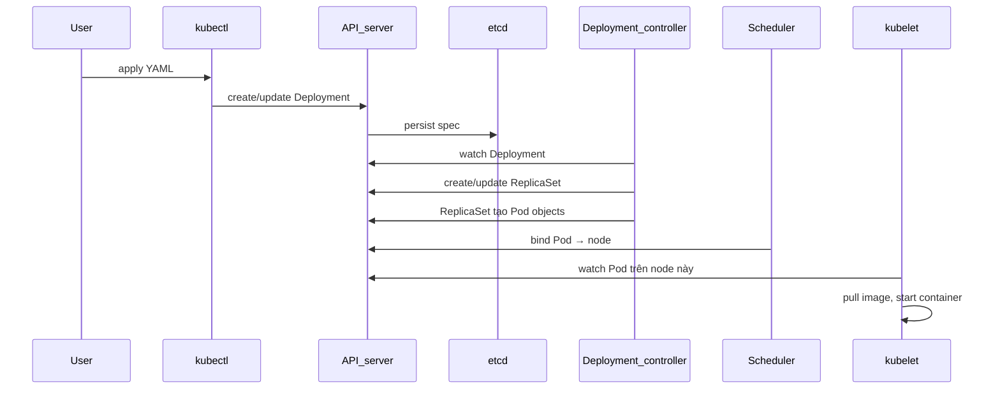
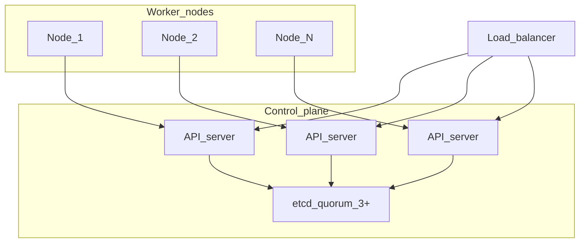

Đây là **phần 2** trong series *Kubernetes từ đầu*. Ở [phần 1](/vi/blog/intro-kubernetes/) bạn đã deploy **Pod**, **Deployment** và **Service**; bài này giải thích **cluster** vận hành phía sau — từ nền tảng đến tổng quan gần production.

## Lộ trình ba level trong bài

| Level | Nội dung | Mục tiêu |
|-------|----------|----------|
| **1 — Cơ bản** | Cluster, node, hai vai trò, desired state | Đọc được `kubectl get nodes` và phân biệt control plane / worker |
| **2 — Trung cấp** | Từng thành phần, reconciliation, `kubectl apply`, `kube-system` | Truy vết Pod từ YAML qua Events |
| **3 — Nâng cao** | Multi-node, HA, CNI, storage, lỗi thường gặp | Hình dung cluster production trước các phần chuyên sâu |

**Yêu cầu:** [minikube](https://minikube.sigs.k8s.io/) đang chạy (như phần 1). Có thể giữ namespace `demo` và Deployment nginx để thực hành Level 2.

> Series test trên Kubernetes **1.27+** (`minikube start --kubernetes-version=v1.27.0` trở lên). Field `grpc` probe (phần 5) và `pathType` (phần 4) cần ≥ 1.27.

---

## Level 1 — Cơ bản

### Cluster và node

**Cluster** (cụm) Kubernetes gồm:

- **API** và **trạng thái** lưu trữ (etcd) — “não” của cluster.
- Một hoặc nhiều **node** — **bare metal** hoặc **VM** chạy workload.

**Node** là host tham gia cluster. Mỗi node có tên, **label** (metadata để scheduler chọn node), và **capacity** (CPU, memory). Xem nhanh:

```bash
kubectl get nodes
kubectl describe node minikube   # thay tên node từ lệnh trên
```

**Cluster** khác **namespace**: cluster là toàn bộ hạ tầng; **namespace** (ví dụ `demo`, `kube-system`) chỉ là ranh giới logic để nhóm object — quyền truy cập chi tiết sẽ có ở phần RBAC (phần 8 series).

### Hai vai trò: control plane và worker

Trong một cluster, ta thường hình dung hai vai trò: **control plane** (điều phối cluster) và **worker node** (nơi Pod chạy). Đây là cách nhìn đơn giản để bắt đầu; cluster thực tế (ví dụ minikube) có thể gộp cả hai trên cùng một node.

| | Control plane | Worker node |
|---|---------------|-------------|
| **Chạy gì** | API server, etcd, scheduler, controller manager | kubelet, kube-proxy, Pod ứng dụng |
| **Vai trò** | Quyết định *cái gì* nên chạy, lưu trạng thái | Thực thi container và **networking** cho Pod |
| **Giao tiếp** | Cung cấp **API server** — hub trung tâm; scheduler/controllers đọc/ghi qua API + etcd | **kubelet** gọi API server: báo node, nhận Pod cần chạy |
| **Pod app của bạn** | Không chạy Pod app của bạn (nginx, API…); node control plane có thể chạy **Pod hệ thống** (etcd, API server dạng static pod) | Chạy Pod ứng dụng mà scheduler gán (nginx trong `demo`, …) |

Mọi thành phần — `kubectl`, scheduler, controllers, và **kubelet** trên worker — đều nói chuyện với cluster qua **API server**. Control plane **không** SSH vào từng worker để bảo “hãy chạy container giúp tôi”.

Phân công gọn:

- **Control plane:** lưu YAML/spec trong etcd, scheduler chọn node, controllers giữ đúng số Pod — *quyết định* Pod nào nên chạy ở đâu.
- **Worker:** **kubelet** trên node đó đọc từ API “Pod X cần chạy trên **node này**”, rồi kéo image và **tạo container thật** (ví dụ hai container nginx trong namespace `demo`).

Tóm lại: control plane **điều phối**; kubelet trên worker **chạy** container. App của bạn (nginx, API service…) nằm trên worker, không phải “chạy ngầm trong control plane”.

Trên minikube, `kubectl get nodes` thường chỉ thấy **một** node vì control plane và workload **cùng một node** — bạn vẫn thấy container hệ thống lẫn app trên đó, nhưng production thường tách nhiều worker riêng.

### Mô hình declarative (trạng thái mong muốn)

Kubernetes là hệ **khai báo** (declarative): bạn mô tả **trạng thái mong muốn** (desired state) trong YAML; hệ thống liên tục điều chỉnh **trạng thái thực tế** (actual state) cho khớp.

Ví dụ từ phần 1: `replicas: 2` trong Deployment nghĩa là “luôn cố gắng có 2 Pod”. Nếu một Pod chết, **controller** sẽ tạo Pod mới. Spec đó được lưu trong **etcd** qua API server — không nằm riêng trên từng node.

**Sau Level 1 bạn biết:**

- Cluster = API Server + etcd + các node.
- Control plane điều phối; worker thực thi Pod.
- YAML mô tả desired state; controller sẽ “vá” khi lệch.

---

## Level 2 — Trung cấp

### Control plane — từng thành phần

| Thành phần | Vai trò | Liên hệ phần 1 |
|------------|---------|----------------|
| **API server** | Cổng REST/gRPC duy nhất; xác thực, phân quyền, admission; đọc/ghi object | Mọi lệnh `kubectl` đi qua đây |
| **etcd** | Cơ sở dữ liệu key-value; lưu toàn bộ spec và trạng thái cluster | Deployment/Service bạn `apply` nằm ở đây |
| **scheduler** | Chọn node phù hợp cho Pod chưa gán node | Cột `NODE` trong `kubectl get pods -o wide` |
| **controller manager** | Nhiều vòng lặp điều khiển: Deployment → ReplicaSet → Pod, Service → Endpoints, Node health… | `replicas: 2` → RS → 2 Pod |

**API server** là điểm vào duy nhất: `kubectl`, dashboard, CI đều nói chuyện với API server, không ghi thẳng vào etcd hay kubelet.

**etcd** giữ *source of truth*. Các thành phần khác **watch** thay đổi trên etcd rồi hành động — mô hình phổ biến trong hệ phân tán.

**Scheduler** chỉ quan tâm Pod mới (chưa có `spec.nodeName`). Nó lọc node khả dụng (đủ CPU/RAM, đúng label, không toleration conflict) rồi chấm điểm chọn một node.

**Controller manager** gom nhiều controller. Ví dụ **Deployment controller**: thấy Deployment đổi → cập nhật ReplicaSet → ReplicaSet controller tạo/xóa Pod cho đủ số replica.

Trên cloud (GKE, EKS, AKS) thường có thêm **cloud-controller-manager**: gắn load balancer, route, volume cloud — tách khỏi logic core.

Kiến trúc tổng thể:



### Worker node — kubelet, kube-proxy, runtime

Trong Kubernetes, **node** là host tham gia cluster. **Worker node** là node nơi Pod app của bạn chạy (ví dụ nginx trong `demo`). **kubelet** và **kube-proxy** đều chạy trên **cùng mỗi worker node** — hai agent trên **cùng một node**, không phải kubelet trên worker còn kube-proxy trên chỗ khác.

[Phần 1](/vi/blog/intro-kubernetes/) giới thiệu Pod/Deployment; bài này (phần 2) đi sâu hạ tầng cluster. Ở đây ta dùng *worker node* khi nói nơi app chạy; *node* là thuật ngữ rộng hơn (mọi node trong cluster, kể cả node control plane trên production).

#### Container runtime và CRI

**kubelet** không tự kéo image hay tạo process container trên OS. Việc đó do **container runtime** — phần mềm chạy container thật (phổ biến nhất hiện nay là **containerd**).

**CRI** (Container Runtime Interface — giao diện runtime container) là **cách kubelet nói chuyện với runtime**: kubelet gửi yêu cầu kiểu “chạy container từ image `nginx:1.27`”, runtime thực hiện pull image và start container. CRI là lớp chuẩn hóa — cluster có thể dùng containerd, CRI-O, v.v. mà kubelet không cần viết riêng cho từng loại.

Không nên nhầm với **Docker CLI** (`docker run` trên laptop): lệnh `docker` là công cụ dev; trên node Kubernetes, kubelet gọi **containerd qua CRI**, không gọi trực tiếp daemon Docker như thời đầu. Debug trên node (nếu có quyền): `crictl ps` (tương tự `docker ps`) liệt kê container mà runtime đang chạy.

#### Ba interface chuẩn: CRI, CNI, CSI

CRI không đứng một mình — Kubernetes tách **ba lớp pluggable** (runtime, networking, storage) qua ba interface chuẩn để kubelet **không** phải viết code riêng cho từng nhà cung cấp:

| Interface | Vai trò | Plugin phổ biến |
|-----------|---------|-----------------|
| **CRI** (Container Runtime Interface) | kubelet ↔ runtime container | containerd, CRI-O |
| **CNI** (Container Network Interface) | kubelet ↔ networking Pod (gán IP, route) | Calico, Cilium, Flannel |
| **CSI** (Container Storage Interface) | kubelet ↔ storage backend (mount volume) | EBS, GCE PD, Ceph, Longhorn |

Cluster mới có thể chọn runtime, CNI và CSI driver khác nhau mà không cần đổi K8s. CNI sẽ gặp lại ở phần [networking trong Level 3](#networking--sau-hậu-trường-service); CSI ở phần 7 (StatefulSet và storage).

**kubelet** — agent trên mỗi worker node: đăng ký node với cluster; nhận Pod được scheduler gán; qua **CRI** nhờ **container runtime** (thường containerd) kéo image và chạy container. Trạng thái Pod (`Running`, `CrashLoopBackOff`) do kubelet báo lên API.

**kube-proxy** — cũng trên **mỗi worker node**, thường chạy dưới dạng **DaemonSet** (một Pod kube-proxy trên mỗi node). Nhiệm vụ: cập nhật **iptables** hoặc **IPVS** trên node để khi có request tới **Service** ClusterIP, traffic được **forward** đúng tới Pod backend. Nhờ đó lệnh `curl http://nginx` trong namespace `demo` ở [phần 1](/vi/blog/intro-kubernetes/) mới hoạt động dù IP từng Pod thay đổi.

### Vòng reconciliation và luồng kubectl apply

**Reconciliation** (điều hòa): controller **watch** object trên API/etcd → so sánh desired vs actual → tạo/sửa/xóa resource con. Lặp liên tục, không chỉ một lần khi bạn `apply`.

Luồng khi `kubectl apply -f deployment-nginx.yaml` (namespace `demo`):



Thực hành (cần Deployment từ phần 1):

```bash
kubectl apply -f deployment-nginx.yaml
kubectl get deployment,rs,pods -n demo
kubectl get pods -n demo -o wide
kubectl describe pod <ten-pod> -n demo
kubectl get events -n demo --sort-by='.lastTimestamp'
```

Trong **Events** của Pod, bạn thường thấy chuỗi: `ScalingReplicaSet` → `Scheduled` → `Pulling` → `Pulled` → `Created` → `Started`. Đó là bằng chứng luồng trên.

### Tour namespace kube-system

Pod hệ thống chạy trong `kube-system`, tách khỏi app của bạn:

```bash
kubectl get pods -n kube-system -o wide
```

| Pod (tên có thể khác trên minikube) | Vai trò |
|-------------------------------------|---------|
| `coredns-*` | DNS nội bộ cluster |
| `kube-proxy-*` | Rule Service trên từng node |
| `kube-apiserver-*`, `etcd-*`, `kube-controller-manager-*` | Thành phần control plane (thường là **static Pod**) |
| CNI plugin (Calico, kindnet, …) | Gán IP cho Pod |

#### Static Pod vs Pod qua API

Ở [phần 1](/vi/blog/intro-kubernetes/), Pod nginx là kiểu **Pod qua API**: bạn `kubectl apply` → object lưu trong etcd → scheduler gán node → kubelet chạy container.

**Static Pod** là cách khác: kubelet **đọc file manifest trên chính node** (thư mục như `/etc/kubernetes/manifests/`) và tự chạy container, **không** cần bạn tạo Deployment hay scheduler gán. API server vẫn **phản chiếu** (mirror) Pod đó lên cluster để `kubectl get pods` thấy được — thường có `-<tên-node>` trong tên Pod.

| | Pod qua API (app của bạn) | Static Pod (thường hệ thống) |
|---|---------------------------|------------------------------|
| **Khai báo** | YAML gửi qua `kubectl apply` | File YAML trên disk của node |
| **Ai quyết định chạy ở node nào** | **Scheduler** | **kubelet** trên node đó (file nằm local) |
| **Ví dụ** | nginx trong namespace `demo` | `kube-apiserver`, `etcd` trên control plane |
| **Bạn có tạo không** | Có — Deployment/Service phần 1 | Không — cluster/bootstrap tạo khi cài |

Trên minikube, xem Pod control plane và (tùy driver) manifest trên node:

```bash
kubectl get pods -n kube-system | grep -E 'apiserver|etcd|controller|scheduler'
minikube ssh -- ls /etc/kubernetes/manifests/
```

Nếu thấy `kube-apiserver-minikube.yaml` (hoặc tương tự) trong thư mục manifests, đó là **static Pod**. Đó cũng giải thích vì sao API server đã chạy ngay khi cluster vừa lên: **kubelet** trên node đọc manifest local và **khởi chạy** các container control plane — trước khi bạn kịp `kubectl apply` bất kỳ app nào qua API.

Pod app trong `demo`, `default`… **luôn** là kiểu qua API. Static Pod chủ yếu cho **bootstrap và vận hành cluster** (API, etcd, scheduler static trên một số bản cài).

Không cần cài thêm — chỉ cần biết **mọi cluster đều có lớp hệ thống** song song workload trong `demo` hay `default`.

**Sau Level 2 bạn biết:**

- Vai trò API server, etcd, scheduler, controller manager, kubelet, kube-proxy.
- `kubectl apply` kích hoạt chuỗi controller → scheduler → kubelet.
- Pod trong `kube-system` phục vụ DNS, networking, control plane.
- Phân biệt **Pod qua API** (app bạn) và **static Pod** (kubelet đọc file trên node, hay gặp ở control plane).

---

## Level 3 — Nâng cao (tổng quan)

Level 3 **không có lab từng bước** như Level 1–2. Mục tiêu là nắm **khái niệm tổng quan**: cluster nhiều node, **HA** (High Availability — chạy dư thừa, tránh sập cả cluster khi **một node** hỏng), **networking**, storage — để khi đọc các phần sau về Ingress, StatefulSet, RBAC… bạn đã biết chúng nằm ở đâu trong bức tranh cluster production.

### Multi-node và HA control plane

| Môi trường | Đặc điểm |
|------------|----------|
| **minikube** | Thường 1 node; control plane + app **cùng node**; không HA |
| **Production** | Nhiều worker; **3+** control plane node; **etcd cluster** (thường 3 hoặc 5 member) tách HA |



#### API server ghi vào etcd cluster — đồng bộ thế nào?

**etcd cluster** là một nhóm **member** etcd (mỗi member thường trên một node riêng), nhưng với **API server** chúng là **một** cơ sở dữ liệu key-value: mọi Deployment, Pod, Service bạn `apply` đều lưu ở đây (đã nói ở **Level 2**).

Khi bạn `kubectl apply`:

1. Request tới **một** API server (qua load balancer nếu có HA).
2. API server ghi object vào **etcd cluster** qua **một danh sách endpoint** chung — **không** ghi riêng vào từng etcd rồi tự đồng bộ tay.
3. Bên trong etcd, thuật toán **Raft** chọn **một leader** cho mỗi thời điểm. Ghi đi qua leader: leader thêm entry vào log, **replicate** sang các follower.
4. Khi **quorum** (đa số member, ví dụ **2 trong 3**) xác nhận → ghi được coi là thành công → API server trả OK. Các member áp dụng cùng entry → state giống nhau trên cả cluster.

Nếu request chạm vào follower, follower **chuyển tiếp** cho leader — API server không cần chỉ định “ghi vào etcd số mấy”.

**Ba API server** trong sơ đồ trên gần như **stateless**: cả ba đọc/ghi **cùng** etcd cluster. Chúng **không** copy state cho nhau; **etcd** vẫn là source of truth duy nhất. HA API = nhiều cổng vào; HA etcd = nhiều bản sao state có quorum.

Vì vậy production hay dùng **3 hoặc 5** member (số **lẻ**): với 3 member, mất **1** node etcd vẫn còn quorum (2/3) và vẫn ghi được; mất **2** trở lên thì mất quorum — khớp dòng **etcd quorum** trong bảng dưới.

| Khái niệm | Ý nghĩa |
|-----------|---------|
| **HA API** | Load balancer phía trước nhiều API server; mỗi instance cùng đọc/ghi một etcd cluster |
| **etcd cluster** | Nhiều member etcd = một logical DB; đồng bộ nội bộ bằng **Raft** (leader + replicate + quorum) |
| **etcd quorum** | Ghi chỉ commit khi đa số member ack; mất **>50%** member → cluster mất khả năng ghi state |
| **Single point** | Một node minikube = toàn bộ cluster phụ thuộc **một node** |

### Networking — sau hậu trường Service

Phần 1 đã dùng **Service** ClusterIP. Trong Level 3, về **networking** trong cluster:

- Mỗi **Pod** có IP riêng trên **flat network** của cluster.
- **CNI** (Container Network Interface) — Calico, Cilium, Flannel… — plugin gán IP và route giữa các Pod trên mọi node.
- **kube-proxy** trên node đích chuyển traffic tới IP Pod backend khi bạn gọi Service.

Luồng khái niệm: **Pod A** → DNS/name **Service** → **kube-proxy** rule → **Pod B**.

Ví dụ DNS (CoreDNS): service `nginx` trong namespace `demo`:

```text
nginx.demo.svc.cluster.local
```

**Ingress** (HTTP từ ngoài vào) và **NetworkPolicy** (firewall giữa Pod) là phần 4 và 8 — chưa cần cấu hình ở bài 2.

### Storage — PV, PVC, StorageClass

| Resource | Vai trò |
|----------|---------|
| **PersistentVolume (PV)** | Khối lưu trữ trong cluster (NFS, disk cloud, …) |
| **PersistentVolumeClaim (PVC)** | Pod “xin” dung lượng; bind với PV phù hợp |
| **StorageClass** | Mẫu cấp phát động: PVC mới → provisioner tạo PV tự động |

Luồng **dynamic provisioning**: `PVC` + `StorageClass` → provisioner → `PV` → mount vào Pod volume.

Demo mount PVC và **StatefulSet** sẽ có ở **phần 7**; bài 2 chỉ cần nhớ: stateful app (DB) cần storage bền vững, tách khỏi vòng đời Pod.

### Khi thành phần gặp sự cố

Bảng gợi ý hướng debug (không thay runbook SRE):

| Thành phần | Triệu chứng thường thấy | Hướng xem |
|------------|-------------------------|-----------|
| API server | `kubectl` timeout, không list được resource | Health control plane, LB, certificate |
| etcd | Cluster “đơ”, object không cập nhật | etcd member, disk, backup/restore |
| scheduler | Pod `Pending`, Events không có `Scheduled` | Resource, taint/toleration, node selector |
| kubelet | `ContainerCreating` lâu, `ImagePullBackOff` | `describe pod`, node `NotReady`, registry |
| CNI | Pod `Running` nhưng không ping được Pod khác | Pod CNI trong `kube-system`, log plugin |

### Quan sát thêm trên minikube

```bash
kubectl get nodes -o yaml | head -n 50
kubectl explain deployment.spec.replicas
minikube status
```

`kubectl explain` đọc schema OpenAPI — hữu ích khi viết YAML mà không nhớ field.

**Sau Level 3 bạn biết:**

- Production khác minikube: HA, nhiều node, etcd quorum.
- CNI + kube-proxy + CoreDNS phối hợp cho networking Pod/Service.
- PV/PVC/StorageClass phục vụ lưu dữ liệu bền vững; lab ở phần 7.
- Biết component nào hay gây `Pending` / `kubectl` lỗi.

---

## Tổng kết và bước tiếp theo

| Level | Đã nắm | Đọc tiếp trong series |
|-------|--------|------------------------|
| 1–2 | Cluster, thành phần, luồng `apply`, `kube-system` | **[Phần 3](/vi/blog/configmap-secret-kubernetes/):** ConfigMap và Secret |
| 3 — networking | CNI, DNS, Service phía sau | **Phần 4:** Ingress |
| 3 — storage | PV, PVC, StorageClass khái niệm | **Phần 7:** StatefulSet + demo storage |
| 3 — vận hành | HA, lỗi gợi ý | **Phần 8:** RBAC; **Phần 11:** Observability |

Bạn không cần thuộc lòng mọi controller — quan trọng là khi `kubectl get pods` lệch mong đợi, bạn biết **hỏi API/etcd, scheduler hay kubelet** trước.

### Tiếp theo trong series

**Phần 3** — [ConfigMap và Secret](/vi/blog/configmap-secret-kubernetes/): tách cấu hình và dữ liệu nhạy cảm khỏi image container, mount env/volume, và rollout khi đổi config.

### Tham khảo

- [Các thành phần Kubernetes (tiếng Việt)](https://kubernetes.io/vi/docs/concepts/overview/components/)
- [Nodes](https://kubernetes.io/docs/concepts/architecture/nodes/)
- [Cluster administration overview](https://kubernetes.io/docs/concepts/cluster-administration/)
- [etcd documentation](https://etcd.io/docs/)
