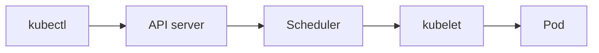

Đây là **phần 1** trong series *Kubernetes từ đầu*. Bài này tập trung vào workload và lệnh thực hành; kiến trúc cluster chi tiết sẽ có ở phần 2.

## Vì sao cần Kubernetes?

**Container** giải quyết bài toán đóng gói: app chạy giống nhau trên môi trường dev, CI và production. Nhưng khi có nhiều service, cần **restart** khi crash, **scale** theo tải, và **cập nhật** không downtime — ta cần một lớp **điều phối** (orchestration).

**Kubernetes** (viết tắt **K8s**) là nền tảng orchestration container phổ biến nhất hiện nay. Bài này giới thiệu ba resource bạn sẽ dùng ngay: **Pod**, **Deployment** và **Service**, kèm demo deploy nginx trên cluster local.

## Cluster trong vài phút

**Cluster** là tập hợp một hoặc nhiều **node** (**VM** hoặc **bare metal**) mà Kubernetes quản lý.

Trong một cluster, ta thường hình dung hai vai trò: **control plane** (điều phối cluster) và **worker node** (nơi Pod chạy). Đây là cách nhìn đơn giản để bắt đầu; cluster thực tế (ví dụ [minikube](https://minikube.sigs.k8s.io/)) có thể gộp cả hai trên cùng một node — chi tiết ở phần 2 series.

Khi bạn gõ lệnh `kubectl`, request đi qua các bước sau:



Ba đơn vị workload trong bài này:

- **Pod** — chạy container.
- **Deployment** — giữ số bản sao Pod, cập nhật có kiểm soát.
- **Service** — điểm truy cập ổn định tới nhóm Pod.

Muốn hiểu từng thành phần control plane, networking và storage? Đọc [phần 2: Kiến trúc cluster](/vi/blog/kien-truc-cluster-kubernetes/).

## Chuẩn bị: kubectl và minikube

Bạn cần:

1. [kubectl](https://kubernetes.io/docs/tasks/tools/) — CLI giao tiếp với cluster.
2. Cluster local — bài này dùng **minikube**:

```bash
minikube start
kubectl cluster-info
```

Các lệnh hữu ích để làm quen:

```bash
# Thông tin cluster và node
kubectl cluster-info
kubectl get nodes

# Xem Pod trên toàn cluster (mọi namespace)
kubectl get pods -A

# Tạo namespace riêng cho demo
kubectl create namespace demo
kubectl config set-context --current --namespace=demo
```

Từ đây, trừ khi ghi chú khác, các lệnh chạy trong namespace `demo`.

## Pod — đơn vị nhỏ nhất

**Pod** là đơn vị triển khai nhỏ nhất trên Kubernetes: thường chứa một hoặc vài container chia sẻ network và storage. Pod có vòng đời ngắn — khi bị xóa hoặc reschedule, IP đổi.

Thử tạo Pod trực tiếp (cách **imperative**, chỉ để học):

```bash
kubectl run nginx --image=nginx --restart=Never
kubectl get pods
kubectl describe pod nginx
kubectl logs nginx
kubectl delete pod nginx
```

Trên môi trường production, ta **không** tạo Pod lẻ tẻ bằng tay mà khai báo qua file YAML (**declarative**). Deployment (phần sau) quản lý Pod giúp bạn.

## Deployment — giữ app chạy ổn định

**Deployment** mô tả trạng thái mong muốn: image nào, bao nhiêu replica, label ra sao. Kubernetes tự tạo Pod, thay thế Pod hỏng, và hỗ trợ **rolling update** khi đổi image.

Lưu manifest sau thành file `deployment-nginx.yaml`:

```yaml title="deployment-nginx.yaml"
apiVersion: apps/v1
kind: Deployment
metadata:
  name: nginx
  namespace: demo
spec:
  replicas: 2
  selector:
    matchLabels:
      app: nginx
  template:
    metadata:
      labels:
        app: nginx
    spec:
      containers:
        - name: nginx
          image: nginx:1.27
          ports:
            - containerPort: 80
```

Áp dụng và kiểm tra:

```bash
kubectl apply -f deployment-nginx.yaml
kubectl get deployments,pods
kubectl scale deployment/nginx --replicas=3
```

`kubectl get pods` sẽ thấy nhiều Pod với prefix `nginx-…` — Deployment đang quản lý chúng.

## Service — truy cập ổn định

Pod có IP riêng và thay đổi khi restart. **Service** cung cấp tên DNS và IP ảo (ClusterIP) trỏ tới tập Pod theo **label** (`app: nginx`).

Loại Service phổ biến:

| Loại | Mục đích |
|------|----------|
| **ClusterIP** | Truy cập **trong** cluster (mặc định) |
| **NodePort** | Mở port trên mỗi node |
| **LoadBalancer** | IP public qua cloud load balancer |

Bài này dùng **ClusterIP**. Manifest `service-nginx.yaml`:

```yaml title="service-nginx.yaml"
apiVersion: v1
kind: Service
metadata:
  name: nginx
  namespace: demo
spec:
  selector:
    app: nginx
  ports:
    - port: 80
      targetPort: 80
  type: ClusterIP
```

```bash
kubectl apply -f service-nginx.yaml
kubectl get svc nginx
```

Thử gọi Service từ một Pod tạm trong cùng namespace:

```bash
kubectl run curl --rm -it --restart=Never --image=curlimages/curl -- curl -s http://nginx
```

Nếu nhận được HTML trang nginx, Service đã route đúng tới Pod backend.

## Demo end-to-end

Checklist gộp các bước trên:

1. `minikube start` (nếu chưa chạy).
2. `kubectl create namespace demo` và chuyển context vào `demo`.
3. `kubectl apply -f deployment-nginx.yaml`
4. `kubectl apply -f service-nginx.yaml`
5. Verify: `kubectl get pods` → trạng thái `Running`; `kubectl get svc nginx` → có `CLUSTER-IP`.
6. Dọn dẹp: `kubectl delete namespace demo`

## Tổng kết

| Resource | Vai trò |
|----------|---------|
| Pod | Chạy container |
| Deployment | Giữ số replica, cập nhật app |
| Service | Truy cập ổn định tới Pod |

Bạn đã có “quick win” đầu tiên trên K8s: khai báo app bằng YAML, scale replica, và gọi Service nội bộ cluster.

### Tiếp theo trong series

**Phần 2** — [Kiến trúc cluster Kubernetes](/vi/blog/kien-truc-cluster-kubernetes/): API server, etcd, scheduler, kubelet, networking và storage theo ba level từ cơ bản đến tổng quan production.

### Tham khảo

- [Tài liệu Kubernetes (tiếng Việt)](https://kubernetes.io/vi/docs/home/)
- [kubectl Cheat Sheet](https://kubernetes.io/docs/reference/kubectl/cheatsheet/)
