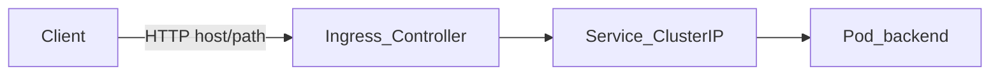

Đây là **phần 4** trong series *Kubernetes từ đầu*. [Phần 1](/vi/blog/intro-kubernetes/) giới thiệu **Deployment** và **Service** ClusterIP; [phần 2](/vi/blog/cluster-architecture-kubernetes/) mô tả control plane và networking trong cluster; [phần 3](/vi/blog/configmap-secret-kubernetes/) tách config bằng **ConfigMap** và **Secret**. Bài này đưa **HTTP từ ngoài cluster** vào app qua **Ingress** và **Ingress Controller**.

## Chuẩn bị

- [minikube](https://minikube.sigs.k8s.io/) đang chạy (`minikube start`).
- Namespace `demo` và workload từ [phần 3](/vi/blog/configmap-secret-kubernetes/):
  - **echo** — `deployment-echo.yaml`, `service-echo.yaml`, ConfigMap `app-config`
  - **nginx-config** — `configmap-nginx-conf.yaml`, `deployment-nginx-configmap.yaml` (chưa có Service — sẽ tạo ở lab bên dưới)

Nếu đã `kubectl delete namespace demo`, chạy lại checklist cuối [phần 3](/vi/blog/configmap-secret-kubernetes/#demo-end-to-end) rồi tiếp tục.

```bash
kubectl config set-context --current --namespace=demo
```

## Vì sao ClusterIP chưa đủ?

[Phần 1](/vi/blog/intro-kubernetes/) và lab [phần 3](/vi/blog/configmap-secret-kubernetes/) dùng **ClusterIP**: client **trong** cluster gọi DNS `echo.demo.svc`. Từ laptop hoặc trình duyệt ngoài cluster, bạn phải `port-forward` hoặc `minikube service` — tiện học tập nhưng không phải mô hình “một URL cho user”.

Các cách expose phổ biến:

| Cách expose | Ai truy cập | Hạn chế (học tập) |
|-------------|-------------|-------------------|
| **ClusterIP** | Trong cluster | Client ngoài cluster **không truy cập trực tiếp** được |
| **NodePort** | IP node + port cao (30000+) | Nhiều app → nhiều port; không route theo host/path HTTP |
| **LoadBalancer** | IP public (cloud) | Xem giải thích bên dưới |
| **Ingress** | Một điểm HTTP(S) vào cluster | Route theo **host** / **path** → nhiều **Service** |

### LoadBalancer — vì sao “tốn chi phí”?

Trên GKE, EKS, AKS…, Service type **LoadBalancer** thường được cloud controller cấp **một IP public hoặc hostname riêng cho từng Service**. Mỗi microservice public một Service LoadBalancer ⇒ nhiều IP, nhiều load balancer, chi phí và quản lý DNS/firewall tăng theo số app.

**Ingress** gom **một** điểm vào (một LB phía trước controller, hoặc controller lắng nghe trên node) rồi **chia** traffic theo quy tắc HTTP — backend vẫn là **Service ClusterIP** như trước.

### L7 là gì?

Theo mô hình OSI (tham chiếu khi đọc tài liệu cloud/K8s):

- **L4** (transport): routing theo **IP + port** (TCP/UDP). **NodePort** và kube-proxy phía **Service** chủ yếu ở tầng này.
- **L7** (application): hiểu **nội dung HTTP** — header `Host`, URL **path**, method — để chọn backend.

**Ingress** làm routing **HTTP ở tầng L7** phía trước **Service**, không chỉ “mở thêm một port” như NodePort.

**Tóm lại:** **Ingress** = lớp routing **HTTP (L7)**; **Service** = ổn định endpoint Pod trong cluster (như [phần 1](/vi/blog/intro-kubernetes/) và kube-proxy ở [phần 2](/vi/blog/cluster-architecture-kubernetes/)).



## Ingress và Ingress Controller

Hai khái niệm hay bị gộp chung:

| Thành phần | Vai trò |
|------------|---------|
| **Ingress** (`networking.k8s.io/v1`) | Object bạn `kubectl apply`: **bảng quy tắc** “request HTTP thế nào → chuyển tới Service nào”. **Không** tự nhận traffic. |
| **Ingress Controller** | Thành phần **chạy thật** trong cluster (Pod): watch Ingress, cấu hình reverse proxy (NGINX, Traefik, …), lắng nghe **80/443**. |

Trên minikube, addon **ingress** cài **NGINX Ingress Controller** trong namespace `ingress-nginx`. Khi controller Ready, `kubectl get ingress` cột **ADDRESS** hiển thị IP (thường trùng `minikube ip`).

**Không có controller** (chưa bật addon) → Ingress object vẫn tồn tại nhưng **không** ai route → ADDRESS trống, `curl` thất bại.

**Đừng nhầm với loại Service:** Trong `kubectl get svc`, bạn chỉ thấy `ClusterIP`, `NodePort`, `LoadBalancer` — **không** có `type: Ingress`. **Ingress** là **resource khác** (`kind: Ingress`), không phải cách “expose” giống NodePort.

Luồng thực tế vẫn hai bước:

1. App của bạn có **Service ClusterIP** (như phần 1) — trỏ Pod trong cluster.
2. **Ingress** + **Ingress Controller** đứng **trước** các Service đó: nhận HTTP từ ngoài, đọc host/path, rồi **chuyển tiếp** vào đúng Service ClusterIP.

Tức Ingress **không thay** Service; nó chỉ là **cổng HTTP** phía ngoài cluster.

## Cài Ingress Controller trên minikube

```bash
minikube addons enable ingress
kubectl get pods -n ingress-nginx
kubectl wait -n ingress-nginx --for=condition=ready pod \
  -l app.kubernetes.io/component=controller --timeout=120s
```

Lấy IP cluster (dùng cho `/etc/hosts`):

```bash
minikube ip
```

Trên macOS/Linux, thêm vào `/etc/hosts` (cần quyền sudo):

```text
<minikube ip> echo.local
<minikube ip> demo.local
```

**Ghi chú:** Trên một số driver (Docker), Service **LoadBalancer** có thể cần `minikube tunnel` chạy nền để có IP external — bài này dùng **Ingress + `/etc/hosts`**, không lab sâu tunnel.

## Tạo Ingress resource

### Giải thích các field trong `spec`

| Field | Ý nghĩa |
|-------|---------|
| **`ingressClassName: nginx`** | Chọn controller nào xử lý Ingress này (addon minikube dùng class `nginx`). Cluster có nhiều controller thì phải khớp class. |
| **`rules[].host`** | **Virtual host** HTTP — ví dụ `echo.local`. Client gửi header `Host: echo.local`; controller match rule tương ứng. |
| **`rules[].http.paths[].path`** | Đường dẫn URL — `/`, `/echo`, `/nginx`, … |
| **`pathType`** | Cách khớp `path` với URI request — Kubernetes định nghĩa **3** giá trị; xem bảng bên dưới. |
| **`backend.service.name`** | Tên **Service** đích (không phải tên Pod/Deployment). |
| **`backend.service.port.number`** | Port trên object **Service** (`spec.ports[].port`), **không** phải `targetPort` container. Ví dụ Service `echo`: port **80** → Pod **8080** ([phần 3](/vi/blog/configmap-secret-kubernetes/#bước-1--biến-môi-trường-configmapkeyref)). |

#### pathType — ba giá trị

| `pathType` | Ý nghĩa | Ví dụ |
|------------|---------|--------|
| **`Prefix`** | Khớp **tiền tố** — rule path là prefix của URI request | Path `/api` match `/api`, `/api/v1`, `/api/docs` (phổ biến nhất) |
| **`Exact`** | Khớp **tuyệt đối** — URI phải trùng path (không thêm segment) | Path `/metrics` match `/metrics` nhưng **không** match `/metrics/` hay `/metrics/cpu` |
| **`ImplementationSpecific`** | Ý nghĩa do **Ingress Controller** quyết định | Lab `ingress-demo`: NGINX dùng kèm regex trong `path` và annotation `use-regex` |

Trong bài: lab **Bước 1** và mẫu TLS dùng **`Prefix`**; lab **Bước 2** (rewrite) dùng **`ImplementationSpecific`** vì pattern path không thuộc hai loại chuẩn kia trên NGINX Ingress.

### Lab — Bước 1: Một host → một Service

Ingress trỏ host `echo.local` tới Service **echo** (đã có từ phần 3):

```yaml title="ingress-echo.yaml"
apiVersion: networking.k8s.io/v1
kind: Ingress
metadata:
  name: echo-ingress
  namespace: demo
spec:
  ingressClassName: nginx
  rules:
    - host: echo.local
      http:
        paths:
          - path: /
            pathType: Prefix
            backend:
              service:
                name: echo
                port:
                  number: 80
```

```bash
kubectl apply -f ingress-echo.yaml
kubectl get ingress echo-ingress -n demo
curl -s http://echo.local/ | head -20
```

Kết quả mong đợi: HTML/text từ **echoserver**, có biến `MESSAGE` từ ConfigMap.

### Lab — Bước 2: Một Ingress, nhiều Service

Một object **Ingress** có thể gom nhiều **path** (hoặc nhiều **host**) trỏ tới **Service** khác nhau — điểm mạnh so với “mỗi app một NodePort/LB”.

**nginx-config** ở [phần 3](/vi/blog/configmap-secret-kubernetes/#bước-2--file-config-volume--volumemount) chỉ trả lời tại path `/` trong container. Khi route theo prefix `/nginx`, controller cần **rewrite** path trước khi gửi tới Pod (annotation của NGINX Ingress).

Tạo Service cho Deployment `nginx-config`:

```yaml title="service-nginx-config.yaml"
apiVersion: v1
kind: Service
metadata:
  name: nginx-config
  namespace: demo
spec:
  selector:
    app: nginx-config
  ports:
    - port: 80
      targetPort: 8080
```

Ingress gộp hai path trên host `demo.local`:

```yaml title="ingress-demo.yaml"
apiVersion: networking.k8s.io/v1
kind: Ingress
metadata:
  name: demo-ingress
  namespace: demo
  annotations:
    nginx.ingress.kubernetes.io/use-regex: "true"
    nginx.ingress.kubernetes.io/rewrite-target: /$2
spec:
  ingressClassName: nginx
  rules:
    - host: demo.local
      http:
        paths:
          - path: /echo(/|$)(.*)
            pathType: ImplementationSpecific
            backend:
              service:
                name: echo
                port:
                  number: 80
          - path: /nginx(/|$)(.*)
            pathType: ImplementationSpecific
            backend:
              service:
                name: nginx-config
                port:
                  number: 80
```

```bash
kubectl apply -f service-nginx-config.yaml
kubectl apply -f ingress-demo.yaml
kubectl get ingress demo-ingress -n demo
curl -s http://demo.local/echo/ | head -10
curl -s http://demo.local/nginx/ | head -5
```

- `http://demo.local/echo/` → Service **echo**
- `http://demo.local/nginx/` → Service **nginx-config** (text `Config from ConfigMap volume`)

Cùng một IP (`minikube ip`) và một host, nhưng **path khác** → **Service** khác.

#### Hai annotation `rewrite` — giải thích chi tiết

Mặc định, NGINX Ingress **giữ nguyên** path khi gửi request tới Pod. Ví dụ client gọi `http://demo.local/nginx/` thì backend nhận URI **`/nginx/`**. Trong [phần 3](/vi/blog/configmap-secret-kubernetes/#bước-2--file-config-volume--volumemount), nginx-config chỉ có `location /` — không match `/nginx/` → dễ **404**. Annotation dưới **cắt prefix** `/echo` hoặc `/nginx` trước khi forward.

| Annotation | Ý nghĩa |
|------------|---------|
| **`nginx.ingress.kubernetes.io/use-regex: "true"`** | Bật khớp **regex** cho `spec.rules[].http.paths[].path`. Không bật thì pattern path trong lab (block `text` ngay dưới) bị coi như path literal, không hoạt động đúng. |
| **`nginx.ingress.kubernetes.io/rewrite-target: /$2`** | Sau khi path khớp, **đổi URI** gửi tới Pod thành `/$2` — `$2` là **nhóm bắt thứ hai** trong regex của path đó. |

Path khai báo dạng **regex có nhóm**:

```text
/nginx(/|$)(.*)
 │     │    └── nhóm 2 ($2): phần còn lại sau /nginx hoặc /nginx/
 │     └── nhóm 1: dấu / hoặc hết path
 └── prefix cố định
```

Ví dụ với `rewrite-target: /$2`:

| Client gọi | Path khớp rule | URI gửi tới Pod (sau rewrite) |
|------------|----------------|----------------------------------|
| `http://demo.local/nginx/` | `/nginx/` | `/` (nhóm 2 rỗng → nginx-config trả `Config from ConfigMap volume`) |
| `http://demo.local/nginx/extra` | `/nginx/extra` | `/extra` |
| `http://demo.local/echo/` | `/echo/` | `/` (echoserver vẫn trả lời được) |

**Tóm lại:** `use-regex` cho phép path có `(...)`; `rewrite-target: /$2` nói controller: “bỏ prefix `/nginx` hoặc `/echo`, chỉ chuyển phần sau sang backend”. Đây là cấu hình **của NGINX Ingress Controller**, không phải field chuẩn trong spec Ingress của Kubernetes — cluster dùng controller khác thì annotation có thể khác tên hoặc không hỗ trợ.

Có thể xóa `echo-ingress` nếu chỉ giữ lab gộp: `kubectl delete ingress echo-ingress -n demo`.

## TLS — giới thiệu ngắn

HTTPS trên Ingress dùng `spec.tls[]` và **Secret** type `kubernetes.io/tls` (đã gặp khái niệm Secret ở [phần 3](/vi/blog/configmap-secret-kubernetes/)):

```yaml title="ingress-tls-sample.yaml"
apiVersion: networking.k8s.io/v1
kind: Ingress
metadata:
  name: echo-tls
  namespace: demo
spec:
  ingressClassName: nginx
  tls:
    - hosts:
        - echo.local
      secretName: echo-tls-secret
  rules:
    - host: echo.local
      http:
        paths:
          - path: /
            pathType: Prefix
            backend:
              service:
                name: echo
                port:
                  number: 80
```

Secret (ví dụ tạo từ cert tự ký — **không** commit key thật vào git):

```yaml title="secret-tls-sample.yaml"
apiVersion: v1
kind: Secret
metadata:
  name: echo-tls-secret
  namespace: demo
type: kubernetes.io/tls
data:
  tls.crt: <base64>
  tls.key: <base64>
```

Bài này **không** lab HTTPS bắt buộc. Production thường dùng [cert-manager](https://cert-manager.io/) hoặc terminate TLS tại load balancer cloud phía trước cluster.

## Cập nhật Ingress và debug

Sửa file Ingress → `kubectl apply -f ...` — controller **reload** cấu hình proxy. Khác ConfigMap mount env ([phần 3](/vi/blog/configmap-secret-kubernetes/#đổi-configmapsecret-và-rollout)): thường **không** cần restart Deployment app.

Khi `curl` lỗi:

| Triệu chứng | Hướng xử lý |
|-------------|-------------|
| Connection refused / không resolve host | Chưa map `/etc/hosts`; sai `minikube ip` |
| ADDRESS trống trong `kubectl get ingress` | Chưa `addons enable ingress`; Pod controller chưa Ready |
| HTTP 404 | Sai tên Service/port; Pod backend chưa Ready; path/backend không khớp |
| HTTP 502/503 | Service không có endpoint — `kubectl get endpoints` |

```bash
kubectl describe ingress demo-ingress -n demo
kubectl get pods -n ingress-nginx
kubectl logs -n ingress-nginx -l app.kubernetes.io/component=controller --tail=30
```

## Best practices và lỗi thường gặp

**Best practices**

- Gom nhiều host/path liên quan vào **một** Ingress khi cùng môi trường/app — dễ quản lý hơn hàng chục object rời.
- Luôn chỉ định **`ingressClassName`** khi cluster có nhiều controller.
- Backend vẫn là **Service ClusterIP** + label selector đúng; Ingress không thay Deployment/Pod.

**Lỗi thường gặp**

- Quên bật addon ingress hoặc chưa đợi controller Ready.
- Quên `/etc/hosts` hoặc nhầm IP sau `minikube stop/start`.
- Nhầm **port Service** (`80`) với **targetPort** container (`8080`) trong `backend.service.port.number`.
- Nhầm **`pathType`** — `Prefix` vs `Exact` vs `ImplementationSpecific` (xem [pathType — ba giá trị](#pathtype--ba-giá-trị)).
- App chỉ listen `/` nhưng Ingress gửi nguyên prefix `/api` — cần **rewrite** (như lab `demo-ingress`) hoặc cấu hình app nhận prefix đó.

## Demo end-to-end

1. `minikube addons enable ingress` và đợi Pod controller Ready.
2. Namespace `demo` + echo + nginx-config từ [phần 3](/vi/blog/configmap-secret-kubernetes/#demo-end-to-end).
3. `ingress-echo.yaml` → verify `curl http://echo.local/`.
4. `service-nginx-config.yaml` + `ingress-demo.yaml` → map `demo.local` trong `/etc/hosts` → `curl` hai path.
5. Dọn: `kubectl delete ingress --all -n demo` hoặc `kubectl delete namespace demo`.

## Tổng kết

| Khái niệm | Vai trò |
|-----------|---------|
| **ClusterIP** | Truy cập nội bộ cluster |
| **NodePort / LoadBalancer** | Expose theo port hoặc IP (L4); LB riêng từng Service tốn chi phí trên cloud |
| **Ingress** | Quy tắc routing HTTP (L7) |
| **Ingress Controller** | Thực thi quy tắc (proxy) |

Bạn đã có luồng: client → **Ingress Controller** → **Service** → **Pod**, vẫn giữ mô hình declarative YAML như các phần trước.

### Tiếp theo trong series

**Phần 5** — [Liveness và Readiness probe](/vi/blog/probes-kubernetes/): kubelet health check, Endpoints và rolling update an toàn.

### Tham khảo

- [Ingress](https://kubernetes.io/docs/concepts/services-networking/ingress/)
- [Ingress on minikube](https://kubernetes.io/docs/tasks/access-application-cluster/ingress-minikube/)
- [NGINX Ingress Controller](https://kubernetes.github.io/ingress-nginx/)
