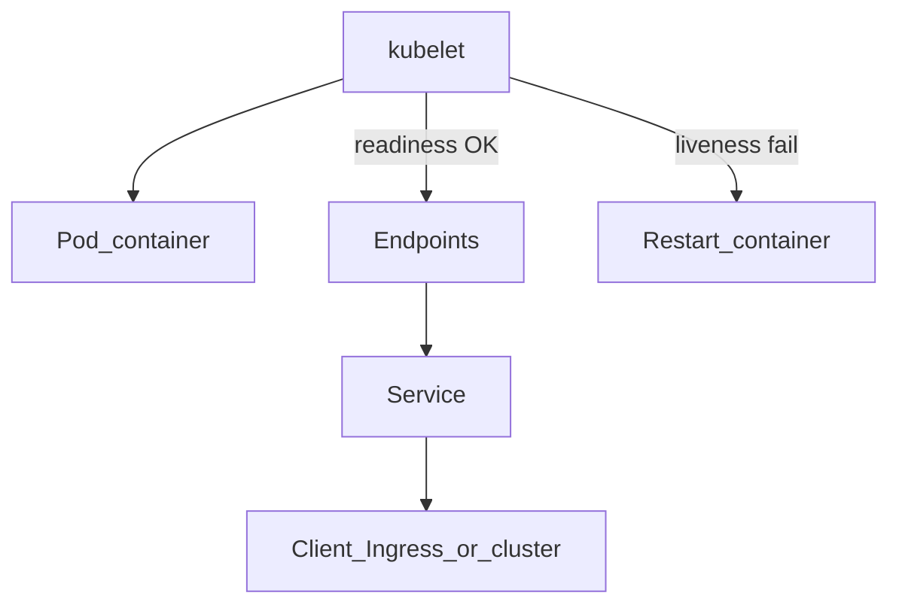

Đây là **phần 5** trong series *Kubernetes từ đầu*. [Phần 1](/vi/blog/intro-kubernetes/) giới thiệu **Deployment** và **rolling update**; [phần 3](/vi/blog/configmap-secret-kubernetes/) có Deployment **echo** và **Service** trong namespace `demo`; [phần 4](/vi/blog/ingress-kubernetes/) đưa HTTP qua **Ingress** — traffic chỉ tới Pod **Ready**. Bài này cấu hình **Liveness** và **Readiness** probe để **kubelet** biết container còn sống và sẵn sàng nhận request.

## Chuẩn bị

- [minikube](https://minikube.sigs.k8s.io/) đang chạy (`minikube start`).
- Namespace `demo` và **echo** từ [phần 3](/vi/blog/configmap-secret-kubernetes/) (`configmap-app.yaml`, `deployment-echo.yaml`, `service-echo.yaml`).

Nếu đã xóa namespace, chạy lại checklist cuối [phần 3](/vi/blog/configmap-secret-kubernetes/#demo-end-to-end) rồi tiếp tục.

```bash
kubectl config set-context --current --namespace=demo
```

## Vì sao cần probe?

Trạng thái container **Running** chỉ có nghĩa process trong container đang chạy — **không** đảm bảo app đã listen port, kết nối DB xong, hay không bị deadlock.

Không có probe:

- **Service** vẫn có thể thêm Pod vào **Endpoints** ngay khi container start → request tới Pod chưa sẵn sàng → connection refused hoặc **502** (như debug [phần 4](/vi/blog/ingress-kubernetes/)).
- App treo nhưng process còn → Kubernetes **không** tự restart.

**Probe** do **kubelet** trên node chạy định kỳ (hoặc sau khi start), không phải Ingress hay Service.

| Probe | Ai chạy | Khi fail |
|-------|---------|----------|
| **Liveness** | kubelet | **Restart** container trong Pod |
| **Readiness** | kubelet | Pod **NotReady** — bỏ khỏi **Endpoints** của Service |
| **Startup** | kubelet | Chặn liveness/readiness cho đến khi startup pass (app khởi động lâu) |



[Phần 4](/vi/blog/ingress-kubernetes/): **Ingress** chỉ forward tới Pod có trong **Endpoints** — tức Pod **Ready** (readiness pass).

## Probe handler và tham số

### Loại probe vs probe handler

| Khái niệm | Số loại | Ý nghĩa |
|-----------|---------|---------|
| **Loại probe** | **3** | `livenessProbe`, `readinessProbe`, `startupProbe` — *khi nào* kiểm tra |
| **Probe handler** | **4** | *Cách* kubelet kiểm tra — mỗi probe chọn **một** handler |

### Handler — bốn loại trong API Kubernetes

| Handler | Khi dùng | Trong bài này |
|---------|----------|---------------|
| **httpGet** | App trả lời HTTP | Lab chính trên **echoserver** |
| **tcpSocket** | Chỉ cần port TCP đang listen | Bảng + snippet |
| **exec** | Chạy lệnh trong container (exit 0 = OK) | Ví dụ YAML |
| **grpc** | App implement [gRPC Health Checking](https://github.com/grpc/grpc/blob/master/doc/health-checking.md) (stable từ 1.27) | Nhắc ngắn; không lab (series dùng HTTP) |

**httpGet** (lab):

```yaml
readinessProbe:
  httpGet:
    path: /
    port: 8080
```

**tcpSocket** (snippet):

```yaml
readinessProbe:
  tcpSocket:
    port: 8080
```

**exec** (snippet):

```yaml
livenessProbe:
  exec:
    command:
      - cat
      - /tmp/healthy
```

### Tham số chung

| Tham số | Ý nghĩa | Mặc định (tham khảo) | Gợi ý |
|---------|---------|----------------------|--------|
| **`initialDelaySeconds`** | Chờ sau khi container **start** rồi mới probe lần đầu | `0` | App start chậm → tăng (`10`–`30`) hoặc dùng **startupProbe** |
| **`periodSeconds`** | Chu kỳ giữa các lần probe | `10` | Readiness có thể dày hơn (`5`) |
| **`timeoutSeconds`** | Timeout **một lần** probe | `1` | Endpoint chậm → tăng nhẹ |
| **`failureThreshold`** | Số lần fail **liên tiếp** trước khi kubelet kết luận | `3` | Liveness đủ ngưỡng → **restart**; Readiness → **NotReady** |
| **`successThreshold`** | Số lần success liên tiếp để chuyển fail → pass | `1` | Readiness “hồi phục” sau lỗi tạm thời |

**Gợi ý thời gian:** `failureThreshold × periodSeconds` ≈ khoảng thời gian sau lần fail đầu trước khi liveness **restart** (ví dụ `3 × 10s` ≈ 30s, sau `initialDelaySeconds`).

## Lab — Bước 1: Probe HTTP trên Deployment echo

Mở rộng [deployment-echo.yaml](/vi/blog/configmap-secret-kubernetes/) — thêm **liveness** và **readiness** `httpGet` tới port **8080** (`containerPort`, không phải Service port 80):

```yaml title="deployment-echo-probes.yaml"
apiVersion: apps/v1
kind: Deployment
metadata:
  name: echo
  namespace: demo
spec:
  replicas: 1
  selector:
    matchLabels:
      app: echo
  template:
    metadata:
      labels:
        app: echo
    spec:
      containers:
        - name: echo
          image: registry.k8s.io/e2e-test-images/echoserver:2.5
          ports:
            - containerPort: 8080
          env:
            - name: MESSAGE
              valueFrom:
                configMapKeyRef:
                  name: app-config
                  key: message
          livenessProbe:
            httpGet:
              path: /
              port: 8080
            initialDelaySeconds: 5
            periodSeconds: 10
            failureThreshold: 3
          readinessProbe:
            httpGet:
              path: /
              port: 8080
            initialDelaySeconds: 3
            periodSeconds: 5
            failureThreshold: 3
```

```bash
kubectl apply -f configmap-app.yaml
kubectl apply -f deployment-echo-probes.yaml
kubectl apply -f service-echo.yaml
kubectl rollout status deployment/echo
kubectl describe pod -l app=echo | grep -A2 "Liveness\|Readiness"
kubectl get endpoints echo
```

Events mong đợi: `Liveness probe succeeded`, `Readiness probe succeeded`. **Endpoints** liệt kê IP Pod khi readiness pass.

## Lab — Bước 2: Readiness và traffic

Scale hai replica (cần cho rolling update sau):

```bash
kubectl scale deployment/echo --replicas=2
kubectl get pods -l app=echo -o wide
kubectl get endpoints echo -o wide
```

Chỉ Pod **Ready** (cột `READY` ví dụ `1/1` và `kubectl get pod` không có `0/1` do readiness) mới có IP trong **Endpoints**.

**Giảm readiness tạm thời** — sửa path probe sai:

```bash
kubectl patch deployment echo --type=json -p='[
  {"op": "replace", "path": "/spec/template/spec/containers/0/readinessProbe/httpGet/path", "value": "/not-found"}
]'
kubectl rollout status deployment/echo
kubectl get endpoints echo
kubectl get pods -l app=echo
```

Pod mới **NotReady** → **Endpoints** có thể chỉ còn Pod cũ (hoặc rỗng nếu tất cả đã rollout). `curl` qua Service chỉ tới Pod Ready:

```bash
kubectl run curl --rm -it --restart=Never --image=curlimages/curl -- \
  curl -s -o /dev/null -w "%{http_code}\n" http://echo.demo.svc
```

Sửa lại path `/`:

```bash
kubectl patch deployment echo --type=json -p='[
  {"op": "replace", "path": "/spec/template/spec/containers/0/readinessProbe/httpGet/path", "value": "/"}
]'
kubectl rollout status deployment/echo
```

**Service** và [Ingress](/vi/blog/ingress-kubernetes/) đều dựa trên **Endpoints** — Pod NotReady không nhận traffic.

## Lab — Bước 3: Liveness fail → restart

Patch **liveness** trỏ port sai (echoserver listen **8080**):

```bash
kubectl patch deployment echo --type=json -p='[
  {"op": "replace", "path": "/spec/template/spec/containers/0/livenessProbe/httpGet/port", "value": 9999}
]'
kubectl get pods -l app=echo -w
```

Quan sát **RESTARTS** tăng sau vài chu kỳ (`failureThreshold` × `periodSeconds`), Events: `Liveness probe failed`. **Không** restart ngay sau một lần fail.

Khôi phục:

```bash
kubectl patch deployment echo --type=json -p='[
  {"op": "replace", "path": "/spec/template/spec/containers/0/livenessProbe/httpGet/port", "value": 8080}
]'
kubectl rollout status deployment/echo
```

**Lưu ý:** Đừng dùng liveness check dependency nặng (DB down) — restart liên tục không giúp app hồi phục. Dùng **readiness** để tạm bỏ Pod khỏi load.

## Rolling update an toàn

Nối [phần 1](/vi/blog/intro-kubernetes/): Deployment mặc định `strategy.type: RollingUpdate`. Pod mới phải **readiness OK** trước khi nhận traffic; Pod cũ terminate dần.

```bash
kubectl get deployment echo -o jsonpath='{.spec.strategy}{"\n"}'
kubectl scale deployment/echo --replicas=2
kubectl rollout restart deployment/echo
kubectl rollout status deployment/echo
kubectl get pods -l app=echo -w
```

Trong lúc rollout, `kubectl get endpoints echo` — IP Pod đổi dần; số endpoint ≥ 1 nếu `maxUnavailable` cho phép (mặc định 25% với `replicas: 2` thường vẫn còn 1 Pod Ready).

Khác [phần 3](/vi/blog/configmap-secret-kubernetes/): đổi ConfigMap/Secret **không** tự tạo Pod mới — đổi **probe** hoặc `spec.template` trong Deployment **có** trigger rollout (như các patch trên).

`maxSurge` / `maxUnavailable` — chỉnh tốc độ thay Pod; bài này không lab sâu.

## Startup probe — giới thiệu ngắn

App khởi động **hàng chục giây**: liveness với `initialDelaySeconds` rất lớn dễ che lỗi thật. **startupProbe** cho phép thời gian start dài (`failureThreshold` cao) mà **không** restart sớm từ liveness.

```yaml title="startup-probe-sample.yaml"
startupProbe:
  httpGet:
    path: /
    port: 8080
  periodSeconds: 5
  failureThreshold: 30
livenessProbe:
  httpGet:
    path: /
    port: 8080
  periodSeconds: 10
```

Trong khi startup chưa pass, liveness/readiness **không** chạy. Bài này **không** lab startup bắt buộc.

## Best practices và lỗi thường gặp

**Best practices**

- **Readiness** — “có nhận traffic không?”; **Liveness** — “có nên restart không?”
- Endpoint `/health` hoặc `/ready` tách biệt trên app thật; demo dùng `/` của echoserver.
- Probe `port` = **containerPort** (`8080`), không nhầm Service port (`80`).

**Lỗi thường gặp**

- `initialDelaySeconds` / `failureThreshold` quá thấp → **CrashLoopBackOff** trước khi app listen.
- Cùng một check nghiêm cho liveness và readiness → vừa restart vừa mất traffic.
- Quên readiness khi deploy qua Ingress → **502** trong lúc rollout.
- Nhầm **kubelet probe** với health check của load balancer bên ngoài cluster.

## Demo end-to-end

1. Namespace `demo` + echo + Service từ phần 3.
2. `deployment-echo-probes.yaml` — verify Events và Endpoints.
3. Patch readiness path sai → Endpoints giảm → sửa lại.
4. Patch liveness port sai → RESTARTS tăng → sửa lại.
5. `replicas: 2` + `kubectl rollout restart deployment/echo` + `rollout status`.
6. Dọn: `kubectl delete namespace demo` (tùy chọn).

## Tổng kết

| Khái niệm | Vai trò |
|-----------|---------|
| **Liveness** | Restart container khi app “chết” |
| **Readiness** | Pod vào/ra **Endpoints** — quyết định traffic |
| **Startup** | Bảo vệ giai đoạn khởi động dài |
| **Handler** | `httpGet`, `tcpSocket`, `exec`, `grpc` |
| **kubelet** | Chạy probe trên node — không phải Ingress |

Bạn đã nối health check Pod với **Service**, **Ingress**, và **rolling update** — nền trước **requests/limits** (phần 6).

### Tiếp theo trong series

**Phần 6** — Requests, Limits và QoS (`resources-limits-kubernetes`): cấp CPU/memory cho container và hành vi khi thiếu tài nguyên.

### Tham khảo

- [Configure Liveness, Readiness and Startup Probes](https://kubernetes.io/docs/tasks/configure-pod-container/configure-liveness-readiness-startup-probes/)
- [Pod lifecycle — probes](https://kubernetes.io/docs/concepts/workloads/pods/pod-lifecycle/#container-probes)
