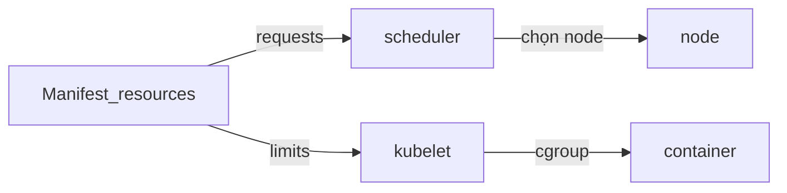

Đây là **phần 6** trong series *Kubernetes từ đầu*. [Phần 1](/vi/blog/intro-kubernetes/) giới thiệu **Deployment**; [phần 2](/vi/blog/cluster-architecture-kubernetes/) mô tả **scheduler** và **kubelet**; [phần 5](/vi/blog/probes-kubernetes/) cấu hình **probe** — kubelet kiểm tra sức khỏe app. Bài này cấp **CPU** và **memory** cho container qua **requests**, **limits**, và hiểu **QoS class** khi node thiếu tài nguyên.

## Chuẩn bị

- [minikube](https://minikube.sigs.k8s.io/) đang chạy (`minikube start`).
- Namespace `demo` (tạo lại nếu cần):

```bash
kubectl create namespace demo --dry-run=client -o yaml | kubectl apply -f -
kubectl config set-context --current --namespace=demo
```

> Series test trên Kubernetes **1.27+** (`minikube start --kubernetes-version=v1.27.0` trở lên). Field `grpc` probe (phần 5) và `pathType` (phần 4) cần ≥ 1.27.

Có thể giữ **echo** từ [phần 3](/vi/blog/configmap-secret-kubernetes/) / [phần 5](/vi/blog/probes-kubernetes/) hoặc chỉ dùng manifest trong bài. Lab **OOM** và **CPU stress** dùng Deployment riêng để không phá workload đang học.

## Vì sao cần requests và limits?

**Scheduler** ([phần 2](/vi/blog/cluster-architecture-kubernetes/)) chọn node dựa trên **requests** — tổng request của Pod phải “vừa” capacity còn lại trên node. Không khai báo request → Kubernetes không **đặt chỗ** rõ ràng → dễ **overcommit** (nhiều Pod hơn tài nguyên thực tế).

**Kubelet** trên mỗi node dùng **cgroup** để enforce **limits** — cô lập container: một process leak memory không nuốt hết RAM node (trong giới hạn cấu hình).

Không có `resources` → Pod **BestEffort** — tranh CPU/RAM với Pod khác; production thường **không** để app quan trọng ở BestEffort.

### Đơn vị

| Resource | Đơn vị | Ví dụ |
|----------|--------|--------|
| **CPU** | core hoặc millicore | `1` = 1 core; `100m` = 0.1 core |
| **Memory** | binary (khuyến nghị) | `128Mi`, `1Gi` — **Mi/Gi** (mebibyte/gibibyte) |

**Lưu ý:** `128M` (decimal megabyte) **khác** `128Mi`. Trong manifest Kubernetes, dùng **`Mi`/`Gi`**.



## Requests vs limits

| Field | Ai dùng | Vai trò | Khi vượt ngưỡng |
|-------|---------|---------|------------------|
| **requests** | **Scheduler** | “Đặt chỗ” CPU/RAM trên node | Pod **Pending** — Events `Insufficient cpu` / `Insufficient memory` |
| **limits** | **Kubelet** (cgroup) | Trần dùng thật | Xem bảng CPU vs memory |

### CPU vs memory — hành vi khác nhau

| Resource | Nén được? | Khi vượt **limit** |
|----------|-----------|---------------------|
| **CPU** | Có (compressible) | **Throttle** — chạy chậm hơn; container **không** bị kill vì CPU |
| **Memory** | Không (incompressible) | **OOM kill** — process trong container bị kill; `reason: OOMKilled` |

**Vượt request nhưng dưới limit:** được phép **burst** (đặc biệt CPU) — ví dụ request `50m`, limit `200m` → có thể dùng tới ~0.2 core trong thời gian ngắn.

### Tranh luận: có nên đặt CPU limit?

Trên production, nhiều team **chỉ set CPU request, bỏ CPU limit**. Lý do thường gặp:

- CPU **throttle** dựa cgroup **CFS quota** trên kernel — period mặc định 100ms. App có thể bị throttle **ngay cả khi node còn CPU rảnh** nếu dùng vượt limit trong một period — gây spike latency.
- Workload latency-sensitive (API, gRPC) đo **p99** cao bất thường khi gần limit.
- Đặt limit chặt → mất phần CPU dư trên node → giảm tỷ lệ tận dụng.

Lập luận ngược lại — vì sao vẫn nên đặt limit:

- **Multi-tenant** cluster (nhiều team dùng chung): thiếu limit → một Pod xấu chiếm hết CPU node, neighbor đói tài nguyên.
- **Test/benchmark** cần kết quả ổn định: limit cố định → so sánh được giữa các lần chạy.

Khuyến nghị theo tình huống:

| Tình huống | CPU limit |
|------------|-----------|
| Cluster **multi-tenant**, team không tin nhau | **Đặt** limit (an toàn neighbor) |
| App **latency-critical**, cluster team tự kiểm soát | **Có thể bỏ** CPU limit (vẫn giữ **memory limit**) |
| Demo / lab series này | **Đặt** — để minh họa throttle |

**Memory limit nên luôn đặt** — memory **không** throttle được; thiếu limit, một process leak có thể dùng hết RAM node, ảnh hưởng cả cluster.

### Gợi ý sizing (demo)

| Workload | requests | limits | Ghi chú |
|----------|----------|--------|---------|
| Web nhẹ | `cpu: 50m`, `memory: 64Mi` | `cpu: 200m`, `memory: 256Mi` | **Burstable** |
| Critical | `cpu: 500m`, `memory: 512Mi` | **bằng requests** | Hướng **Guaranteed** |

**Quy tắc:** `requests` ≤ `limits` (từng resource). Để đạt **Guaranteed**, cần thêm điều kiện QoS (mục dưới).

## QoS classes

**QoS** (Quality of Service) là nhãn Kubernetes gán cho **Pod** — field `status.qosClass` — dựa trên `resources` của **mọi container** trong Pod (kể cả sidecar). **Init container** cũng được tính khi xác định QoS Pod; bài này không lab init.

### Ba class — điều kiện

Theo [Pod QoS](https://kubernetes.io/docs/concepts/workloads/pods/pod-qos/):

| QoS | Điều kiện (mọi container trong Pod) | Ý nghĩa |
|-----|--------------------------------------|---------|
| **Guaranteed** | Có **cpu** và **memory**; với **từng** resource, **request = limit** | Ưu tiên **cao nhất** khi node thiếu tài nguyên |
| **Burstable** | Có ít nhất một `requests` hoặc `limits`, nhưng **không** đạt Guaranteed | Phổ biến nhất |
| **BestEffort** | **Không** có `requests`/`limits` cho bất kỳ container nào | Ưu tiên **thấp nhất** |

### Ví dụ YAML → qosClass

| Manifest | qosClass kỳ vọng |
|----------|------------------|
| Không có `resources` | `BestEffort` |
| `requests.memory: 64Mi`, `limits.memory: 128Mi` (request < limit) | `Burstable` |
| `requests` == `limits` cho **cpu** và **memory** | `Guaranteed` |

### Eviction khi node thiếu memory

Khi node **áp lực memory**, **kubelet** có thể **evict** Pod (khác **OOMKilled** trong một container):

1. **BestEffort** trước
2. **Burstable** đang dùng **nhiều hơn requests** (tỷ lệ usage/request cao)
3. **Burstable** trong phạm vi requests
4. **Guaranteed** cuối

Bài này **không** lab ép node full RAM — chỉ nêu thứ tự khái niệm.

### OOMKilled trong container

**OOMKilled** = container vượt **memory limit** của **chính nó** (cgroup) — kernel kill process. Không cần cả node hết RAM. Lab Bước 2 minh họa trường hợp này.

**Guaranteed không miễn OOM:** QoS cao chỉ ảnh hưởng **eviction** trên node; vượt **memory limit** vẫn **OOMKilled**.

### Đọc QoS trên cluster

```bash
kubectl get pods -n demo -o custom-columns=NAME:.metadata.name,QOS:.status.qosClass
```

### Lab QoS — ba Deployment

Ba manifest song song (cùng image **echoserver**, khác `resources`):

**1. BestEffort** — không `resources`:

```yaml title="deployment-echo-besteffort.yaml"
apiVersion: apps/v1
kind: Deployment
metadata:
  name: echo-besteffort
  namespace: demo
spec:
  replicas: 1
  selector:
    matchLabels:
      app: echo-besteffort
  template:
    metadata:
      labels:
        app: echo-besteffort
    spec:
      containers:
        - name: echo
          image: registry.k8s.io/e2e-test-images/echoserver:2.5
          ports:
            - containerPort: 8080
```

**2. Burstable** — request < limit:

```yaml title="deployment-echo-burstable.yaml"
apiVersion: apps/v1
kind: Deployment
metadata:
  name: echo-burstable
  namespace: demo
spec:
  replicas: 1
  selector:
    matchLabels:
      app: echo-burstable
  template:
    metadata:
      labels:
        app: echo-burstable
    spec:
      containers:
        - name: echo
          image: registry.k8s.io/e2e-test-images/echoserver:2.5
          ports:
            - containerPort: 8080
          resources:
            requests:
              cpu: 50m
              memory: 64Mi
            limits:
              cpu: 200m
              memory: 128Mi
```

**3. Guaranteed** — request = limit (cpu và memory):

```yaml title="deployment-echo-guaranteed.yaml"
apiVersion: apps/v1
kind: Deployment
metadata:
  name: echo-guaranteed
  namespace: demo
spec:
  replicas: 1
  selector:
    matchLabels:
      app: echo-guaranteed
  template:
    metadata:
      labels:
        app: echo-guaranteed
    spec:
      containers:
        - name: echo
          image: registry.k8s.io/e2e-test-images/echoserver:2.5
          ports:
            - containerPort: 8080
          resources:
            requests:
              cpu: 100m
              memory: 128Mi
            limits:
              cpu: 100m
              memory: 128Mi
```

```bash
kubectl apply -f deployment-echo-besteffort.yaml
kubectl apply -f deployment-echo-burstable.yaml
kubectl apply -f deployment-echo-guaranteed.yaml
kubectl get pods -n demo -l 'app in (echo-besteffort,echo-burstable,echo-guaranteed)' \
  -o custom-columns=NAME:.metadata.name,QOS:.status.qosClass
```

Kỳ vọng: `BestEffort`, `Burstable`, `Guaranteed` tương ứng.

## metrics-server và kubectl top

`kubectl top` đọc từ **metrics-server** (Metrics API), không phải trực tiếp từ kubelet:

```bash
minikube addons enable metrics-server
# Đợi 1–2 phút nếu báo metrics chưa sẵn sàng
kubectl get apiservice v1beta1.metrics.k8s.io \
  -o jsonpath='{.status.conditions[?(@.type=="Available")].status}{"\n"}'
kubectl top nodes
kubectl top pods -n demo
kubectl top pod -l app=echo-burstable --containers
```

So sánh cột **CPU(cores)** / **MEMORY** với `requests`/`limits` trong `kubectl describe pod` để chỉnh sizing. Độ trễ vài chục giây; dùng **ước lượng**, không thay monitoring production. **HPA** (phần 9 series) cũng cần metrics.

## Lab — Burstable chi tiết

Nếu bạn đã có Deployment `echo` từ [phần 5](/vi/blog/probes-kubernetes/) với probe, thêm block `resources` (Burstable):

```yaml
          resources:
            requests:
              cpu: 50m
              memory: 64Mi
            limits:
              cpu: 200m
              memory: 128Mi
```

```bash
kubectl apply -f deployment-echo-burstable.yaml   # hoặc patch deployment/echo
kubectl describe pod -l app=echo-burstable | grep -A8 "Limits\|Requests"
kubectl get pod -l app=echo-burstable -o jsonpath='{.items[0].status.qosClass}{"\n"}'
kubectl top pod -l app=echo-burstable -n demo
```

## Lab — OOMKilled

Deployment riêng — cố ý vượt **memory limit**:

```yaml title="deployment-oom-demo.yaml"
apiVersion: apps/v1
kind: Deployment
metadata:
  name: oom-demo
  namespace: demo
spec:
  replicas: 1
  selector:
    matchLabels:
      app: oom-demo
  template:
    metadata:
      labels:
        app: oom-demo
    spec:
      containers:
        - name: stress
          image: polinux/stress
          args: ["--vm", "1", "--vm-bytes", "80M", "--vm-hang", "1"]
          resources:
            requests:
              memory: 50Mi
              cpu: 100m
            limits:
              memory: 50Mi
              cpu: 100m
```

```bash
kubectl apply -f deployment-oom-demo.yaml
kubectl get pods -l app=oom-demo -w
kubectl describe pod -l app=oom-demo
kubectl get pod -l app=oom-demo \
  -o jsonpath='{.items[0].status.containerStatuses[0].lastState.terminated.reason}{"\n"}'
```

Kỳ vọng: `OOMKilled`, **RESTARTS** tăng nếu Deployment restart Pod. Khác [liveness probe fail](/vi/blog/probes-kubernetes/) — ở đây kill do **cgroup memory**, không phải probe.

Manifest trên có cpu request=limit → Pod **Guaranteed** nhưng vẫn OOM khi process cần > `50Mi`.

```bash
kubectl delete deployment oom-demo -n demo
```

## Lab — CPU throttle

Deployment `cpu-stress` — yêu cầu CPU cao nhưng **limit** thấp:

```yaml title="deployment-cpu-stress.yaml"
apiVersion: apps/v1
kind: Deployment
metadata:
  name: cpu-stress
  namespace: demo
spec:
  replicas: 1
  selector:
    matchLabels:
      app: cpu-stress
  template:
    metadata:
      labels:
        app: cpu-stress
    spec:
      containers:
        - name: stress
          image: polinux/stress
          args: ["--cpu", "2", "--timeout", "120s"]
          resources:
            requests:
              cpu: 50m
            limits:
              cpu: 100m
```

```bash
kubectl apply -f deployment-cpu-stress.yaml
kubectl get pods -l app=cpu-stress
kubectl top pod -l app=cpu-stress -n demo --containers
```

Pod vẫn **Running** — không **OOMKilled**. CPU usage bị **cap** quanh limit (`~0.1` core); workload **chậm** — minh họa CPU **compressible**.

```bash
kubectl delete deployment cpu-stress -n demo
```

## LimitRange và ResourceQuota

Ở production, team/platform thường thêm:

- **LimitRange** — default hoặc min/max `requests`/`limits` cho Pod/Container trong namespace.
- **ResourceQuota** — tổng CPU/memory namespace được phép dùng.

Bài này **không** apply hai object dưới (để không can thiệp namespace `demo` đang dùng cho lab) — nhưng đây là mẫu reader gặp lại khi đọc YAML cluster production:

```yaml title="limit-range-demo.yaml"
apiVersion: v1
kind: LimitRange
metadata:
  name: defaults
  namespace: demo
spec:
  limits:
    - type: Container
      default:           # áp vào limits nếu container không khai báo
        cpu: 200m
        memory: 256Mi
      defaultRequest:    # áp vào requests nếu container không khai báo
        cpu: 50m
        memory: 64Mi
      max:               # trần — Pod yêu cầu vượt sẽ bị API server từ chối
        cpu: "1"
        memory: 1Gi
```

```yaml title="resource-quota-demo.yaml"
apiVersion: v1
kind: ResourceQuota
metadata:
  name: team-budget
  namespace: demo
spec:
  hard:
    requests.cpu: "4"
    requests.memory: 8Gi
    limits.cpu: "8"
    limits.memory: 16Gi
    pods: "20"
```

Lưu ý: **LimitRange** cần apply **trước** workload — Pod đã tồn tại không tự được gán default. **ResourceQuota** là tổng cứng cho namespace; vượt → `kubectl apply` bị reject với lỗi `exceeded quota`.

## Best practices và lỗi thường gặp

**Best practices**

- Luôn set **requests** + **limits** cho workload production; tune từ `kubectl top` và monitoring.
- **Memory limit** ≥ peak thực tế + headroom (JVM, buffer, spike).
- **CPU request** ≈ baseline; **limit** > request nếu cho burst ngắn.
- Workload critical — cân nhắc **Guaranteed** (`requests == limits` cho cpu và memory).
- Không dùng **BestEffort** cho app user-facing.

**Lỗi thường gặp**

- Tưởng **Guaranteed** = không bao giờ OOM — vẫn **OOMKilled** nếu vượt **memory limit**.
- Nhầm **CPU throttle** (chậm) với **OOMKilled** (restart).
- Chỉ set **limit** không **request** — Burstable, eviction khó dự đoán.
- Nhầm **Mi** vs **M**.
- Pod **Pending** — node không đủ **requests** ([phần 2](/vi/blog/cluster-architecture-kubernetes/)).
- `kubectl top` lỗi — chưa bật metrics-server.
- Sidecar không set `resources` → cả Pod không **Guaranteed** dù app chính đã set đủ.

## Demo end-to-end

1. `minikube addons enable metrics-server`
2. Lab QoS: `deployment-echo-besteffort.yaml`, `deployment-echo-burstable.yaml`, `deployment-echo-guaranteed.yaml`
3. `kubectl top` + `describe` Limits/Requests
4. `deployment-oom-demo.yaml` → OOMKilled → xóa
5. `deployment-cpu-stress.yaml` → quan sát throttle → xóa
6. Dọn: `kubectl delete namespace demo` (tùy chọn)

## Tổng kết

| Khái niệm | Vai trò |
|-----------|---------|
| **requests** | Scheduler “đặt chỗ” trên node |
| **limits** | Kubelet enforce qua cgroup |
| **CPU vượt limit** | Throttle |
| **Memory vượt limit** | OOMKilled |
| **Guaranteed / Burstable / BestEffort** | QoS — ưu tiên khi node thiếu RAM |
| **metrics-server** | Nguồn cho `kubectl top` |

Bạn đã nối cấp phát tài nguyên với scheduling và hành vi container — nền cho **HPA** (phần 9) và **Storage** (phần 7).

### Tiếp theo trong series

**Phần 7** — Storage và **StatefulSet** (`storage-statefulset-kubernetes`): PV, PVC, StorageClass và workload có state.

### Tham khảo

- [Manage resources for containers](https://kubernetes.io/docs/concepts/configuration/manage-resources-containers/)
- [Assign memory resources](https://kubernetes.io/docs/tasks/configure-pod-container/assign-memory-resource/)
- [Configure Pod QoS](https://kubernetes.io/docs/tasks/configure-pod-container/quality-service-pod/)
- [Pod QoS classes](https://kubernetes.io/docs/concepts/workloads/pods/pod-qos/)
